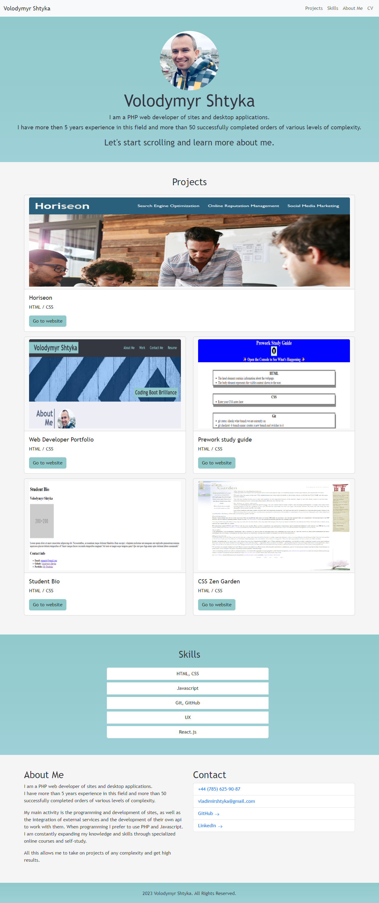

# Volodymyr Shtyka - Bootstrap Portfolio

## Overview

This repository showcases the portfolio of Volodymyr Shtyka, a PHP web developer. It includes a navigation bar, hero
section, projects, skills, about me, and contact sections.

## Preview

## Link to the Deployed Application

[https://volodymyr-shtyka.github.io/Bootstrap-Portfolio/](https://volodymyr-shtyka.github.io/Bootstrap-Portfolio/)

## Installation Instructions

To view this project locally, follow these steps:

1. Clone the repository: `git clone git@github.com:Volodymyr-Shtyka/Bootstrap-Portfolio.git`
2. Navigate to the project directory: `cd Bootstrap-Portfolio`
3. Open the `index.html` file in your web browser.

## Features
- Navigation bar with links to different sections.
- Hero section with an introduction and a rounded profile image.
- Projects section showcasing various projects using Bootstrap cards.
- Skills section displaying a list of skills.
- About Me section with a brief overview of Volodymyr Shtyka.
- Contact section with links to phone, email, GitHub, and LinkedIn.
- Footer with copyright information.

## Technologies Used
- HTML
- CSS
- Bootstrap (v5.3.2)
- Bootstrap Icons (v1.11.2)

## Contact
- Phone: [+44 (785) 625-90-87](tel:+447856259087)
- Email: [vladimirshtyka@gmail.com](mailto:vladimirshtyka@gmail.com)
- GitHub: [Volodymyr-Shtyka](https://github.com/Volodymyr-Shtyka)
- LinkedIn: [vshtyka](https://www.linkedin.com/in/vshtyka)

## Configuration
This project doesn't require specific configuration. However, feel free to customize the content or styling to suit your preferences.

## Contributing Guidelines
Contributions to this project are not currently accepted. If you have suggestions or find issues, please [create an issue](https://github.com/Volodymyr-Shtyka/Bootstrap-Portfolio/issues).

## License
This project is licensed under the [MIT License](LICENSE).

## Acknowledgments
- Bootstrap - [https://getbootstrap.com/](https://getbootstrap.com/)
- Bootstrap Icons - [https://icons.getbootstrap.com/](https://icons.getbootstrap.com/)